The STK Graphical User Interface
=================================

The Graphical User Interface (GUI) is used to perform all of the STK's primary
functionality. It allows you to enter data, visualise data and process data all
within a single interface.

Starting out
------------

To open the GUI either click on the icon or run the following on the command
line:

.. code-block:: bash

    stk-gui [file]

The GUI looks like this.

.. _img-stk-gui:

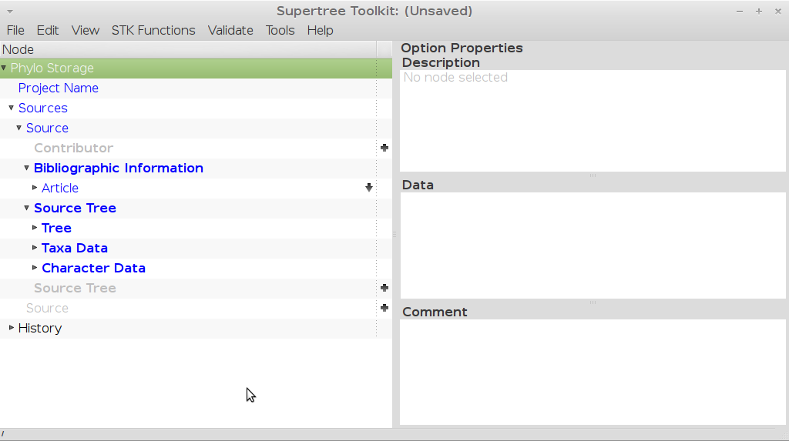

    The STK GUI with no data loaded. The GUI consists of two vertical panels
    where data are edited (left) and entered (right).

The GUI consists of two main halves (Fig. :num:`#img-stk-gui`). The left-hand
side is a tree-structure that allows you to navigate the data (tree panel). The
data are structured into a project, which in turn contains sources, which in turn
contain trees and meta data. The right-hand side (data panel) contains three
sub-panels. Each of these divisions is called an element (Fig.
:num:`#img-stk-gui-lab`). The top gives context-sensitive documentation on
the current selection in the left-hand side. The middle is where you add data.
Depending on what part of the data you are editing, the middle panel will change
to suit the data to be edited/input.  The lowermost sub-panel is where you can
add any comments for that part of the dataset. This is not enabled for all
sections of the data but should be used wherever it is useful. 

.. _img-stk-gui-lab:

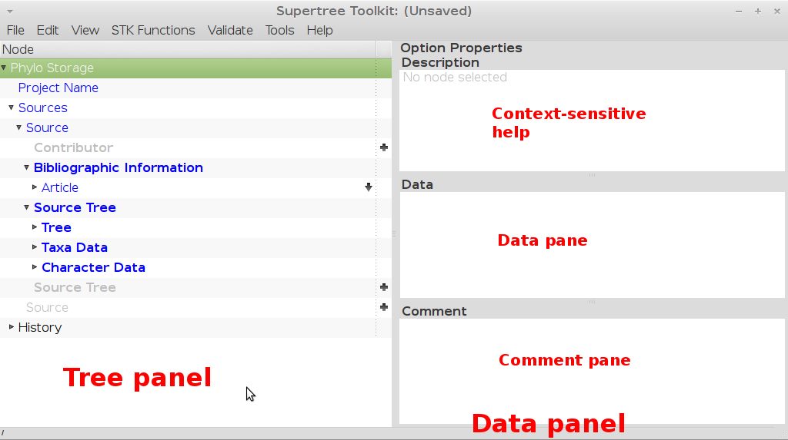

    The STK GUI with each pane and panel labelled.

To navigate the left hand side, click the small arrows on the left. These will
open and close sub-data within the hierarchy. On the right-hand side of the tree,
there are small "+" and "-" signs to allow you add or remove data. Where the
data are a choice, a dropdown list is activated on the right hand side.

The colour in the left-hand side tree informs you if there is missing data. Blue
lines show you are missing required data. The blue then progresses upwards from
the missing data, all the way to the uppermost level. This allows you to drill
downwards to find the missing data. Black text indicates you have fulfilled the
minimum requirements.

There are two types of menus - the main menu on the toolbar and a right-click
menu. This toolbar menu contains:
 * File
 * Edit
 * View
 * STK Functions
 * Validate
 * Tools
 * Help

Of these, the File and STK Functions are most often used. More on these will be
covered later, but briefly the File menu contains commands to open and save data,
plus import and export data.  The STK Functions menu contains all the STK-only
functionality.

The right click menu allows you to copy and paste elements (e.g. you can copy
and past a source from the same or another file) and change how the data are
visualised. These are covered later.

Entering data
-------------

The best way to start a new dataset is to import a bibliographic file. The STK
uses `bibtex format <http://www.bibtex.org/>`_, which is a common format and that all
decent reference managers can output, as can most journal websites. We recommend
using `JabRef <http://jabref.sourceforge.net/>`_, which is free, open source and
available on most OS. We have tested the STK extensively with output from
JabRef, but your mileage with other reference managers may vary.

.. index:: bibtex

Once you have a Bibtex file you can import it using the File->Import from
bibliography and import your file. This should import all the papers in that
bibtex file and create a source for each one (Fig. :num:`#img-stk-source`). These
are then named in a sensible way and sorted alphabetically. The standard source
name is the author followed by year. Once the sources are created, 
you can then start editing your data.

.. _img-stk-source:

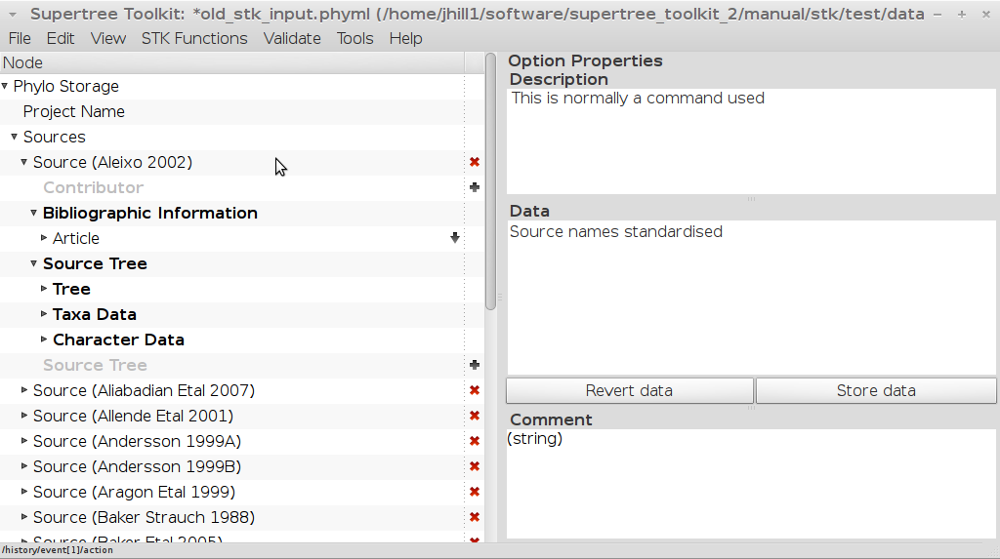

    A source element that consists of a bibliographic entry, with the data
    contained in that paper nested below.

The next thing you will want to do is import some trees. You can use any
software you wish to digitise your trees. The STK will read the output of most
software. To import a tree, drill down the tree panel to the correct source, then
open the Tree element and click on the Tree string element. The import tree
button will then appear in the status bar, in the lower left of the GUI (Fig.
:num:`#img-stk-import-tree`).

.. _img-stk-import_tree:

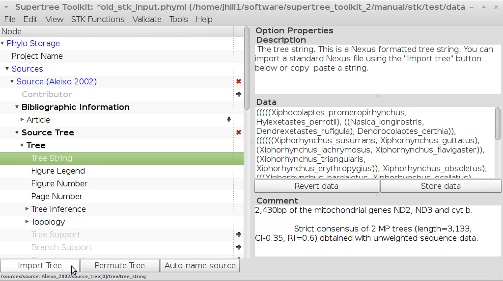

    The import tree button. Click to import a tree into a source.

Once done, your tree string will appear in the data panel. This will also name the tree in the STK. The names
follow a standard pattern of "Source_name_d" where d is a number starting from 1. You can manually
edit the tree name if you wish. 

.. warning:: Avoid non-standard characters in taxa names. Your names *must* not contain commas, 
    parentheses, colons, asterisks, hyphens, slashes or percentage signs (percentage signs are allowed for non-monophyletic taxa - see later).
    These are not allowed in taxa names in Newick format as they mean other things.
    
.. note:: Quoted taxa should be done with single quotes only ('), not double or "smart
          quotes"

Using the interface
-------------------

There are a number of useful functions in the STK GUI to aid in data entering
and exploration. They are slicing data, grouping data, and copy and pasting
data sections. 

.. index:: grouping

Grouping data allows all elements of a certain type to be displayed
simultaneously. For example, grouping on, say, "Tree String" will show all trees
in the dataset. To group data, right click on an element you want to group on
and select *Group*. The tree panel will then show the grouping (Fig
:num:`#img-stk-grouping`). Right-click and select ungroup to return to the
original view.

.. _img-stk-grouping:

.. figure:: images/stk_gui_grouped.png   
    :align: center
    :alt: Grouped data
    :figclass: align-center

    Data view after grouping on tree string. Note the source name and all tree
    strings are all visible.

.. index:: slicing

Slicing data allows an easy way to enter similar data on a large number of
elements. Right-click page number of any source, select *Slice* and you will see
a list of all sources, with the data pane next to each source. You can now
quickly edit all page numbers (Fig. :num:`#img-stk-slice`).

.. _img-stk-slice:

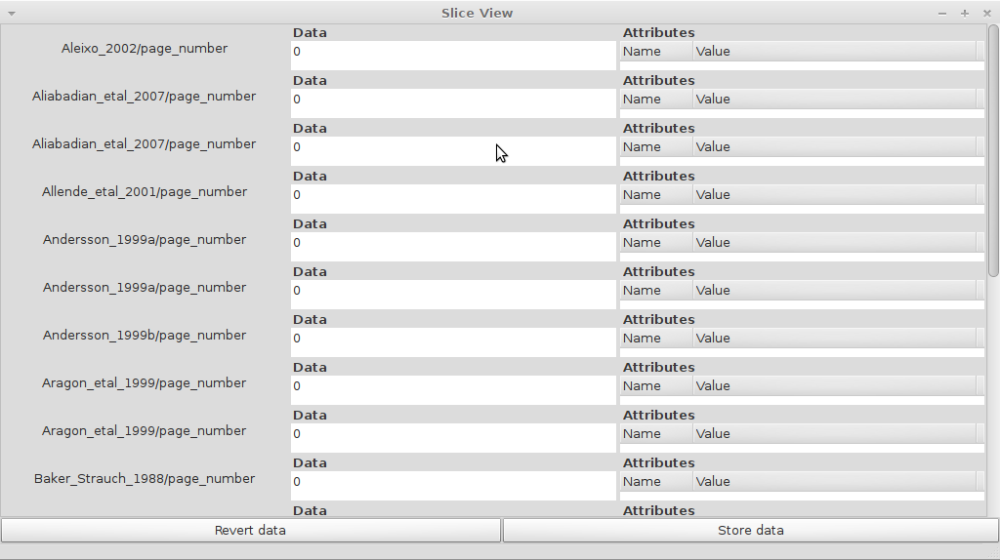

    Data view after slicing the data on page number. 

.. index:: copy, paste

Copy and pasting can be done between files or within the same file. Right-click
an element, select *Copy*, then select another element *of the same type* and
right-click and select *Paste*.

Checking data
-------------

.. index:: data summary

There are a number of functions to help summarise the data and aid in data
checking. First is the *Data summary*, which can be accessed via STK
Functions->Data Summary. Activating this brings up a window containing the
number of trees in the dataset, the taxa list, character list, and years (Fig.
:num:`#img-stk-data-summary`). The output can be saved or copy and pasted as
required. This can be used to **carefully** check the taxa list for
user errors, for example

.. note:: Incomplete data (with blue elements) may not produce a sensible data summary.
    
.. note:: See the tutorial for more information on how nomenclature and taxonomy should be standardised.

.. _img-stk-data-summary:

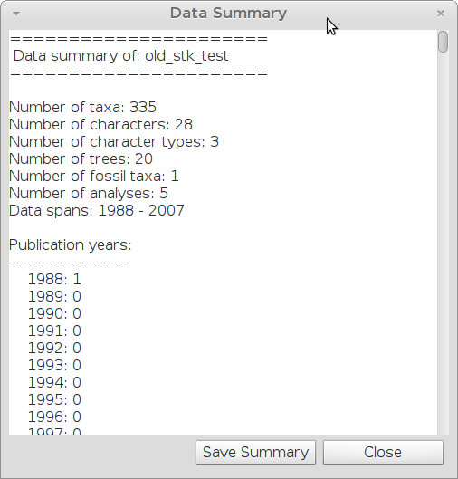

    Output from the data summary.

Two other functions can also be useful to check the data (and prevent errors
when using other functions). *Clean Data* removes non-informative trees.

.. warning:: Do not use Clean Data on partial datasets. It will delete empty sources
    for example, which may not be what you wish to happen.

*Standardise source names* ensures all source names are unique and will re-sort
the sources alphabetically. It will also stnadardise all tree names.

Processing data
---------------

Processing data is done using a number of functions. These are covered in more
detail in the tutorial, but briefly compose of the following functions:

 * Data independence check
 * Data overlap
 * Sub taxa
 * Permute all trees
 * Replace genera
 * STR
 * Create subset
 * Create Matrix

Data independence check
***********************

This allows you to check if any of the data in your dataset replicates or is a
subset of another data source. The interface shows which sources are identical
and can be safely removed in the upper half (Fig.
:num:`#img-stk-data-ind-action`). The lower half shows subsets. The
flagged data should be checked and removed if possible.

.. _img-stk-data-ind-action:

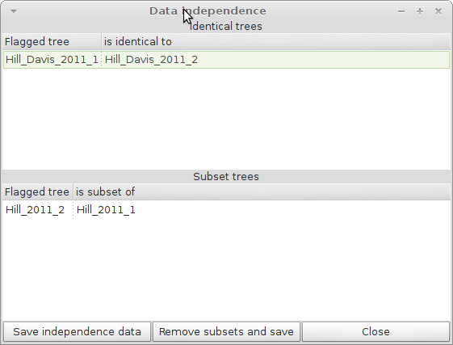

    Output from the data independence check.

Data overlap
************

In order to construct a supertree the source trees must have sufficient
taxonomic overlap; that is at least two taxa in a source tree must occur in at
least one other tree. The STK allows you to both check and visualise this overlap.

The interface (Fig. :num:`#img-stk-data-overlap-gui`) contains options to select
the level of overlap (default is 2), which is the number of taxa trees should
have in common to be considered connected. The two graphic check boxes will show
a window with the result as a graphic. There are two options; the normal graphic
(Fig :num:`#img-stk-data-overlap-simple`) and detailed graphic (Fig
:num:`#img-stk-data-overlap-detailed`). All graphics show each tree or group
of trees as a circle, labelled by a number. The window also contains a list which
maps the number to a tree name, allowing you to delete any trees that don't
sufficently overlap.

.. _img-stk-data-overlap-gui:

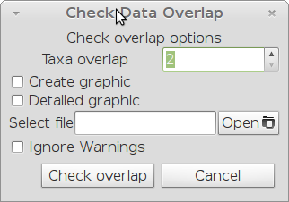

    Data overlap GUI.

.. _img-stk-data-overlap-simple:

.. figure:: images/stk_gui_check_overlap_simple_graphic.png   
    :align: center
    :scale: 50 %
    :alt: Data overlap simple graphic
    :figclass: align-center

    Normal graphical view of data overlap. For a correctly connected dataset
    there should be a single node (circle). These data are not sufficiently well
    connected.

.. _img-stk-data-overlap-detailed:

.. figure:: images/stk_gui_check_overlap_detailed_result.png   
    :align: center
    :scale: 50 %
    :alt: Data overlap detailed graphic
    :figclass: align-center

    Detailed graphical view of data overlap. For a correctly connected dataset
    there should be no red nodes (circles) in the graph. These data are not sufficiently well
    connected.

Sub Taxa
********

Taxa substitutions and deletions are a key part of ensuring a standardised
nomenclature and taxonomy for supertree analysis. However, it is usually quite cumbersome to
carry out this operation on a number of tree or matrix files. The STK will
ensure that taxa substitutions are consistent across the whole dataset and any
taxonomic information is also updated. You can construct taxa deletions and
substitutions using the *Sub taxa* interface (Fig. :num:`#img-stk-sub-taxa`).
Move taxa from the dataset to the right-hand side and add the replacements or
leave blank for a deletion. The substitutions created can be saved to a *subs
file*. A subs file can also be imported, either as a substitution (or subs) file 
or as a CSV file.

.. _img-stk-sub-taxa:

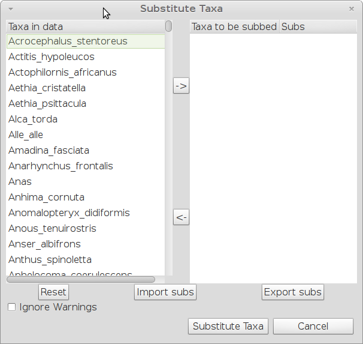

    Substitute taxa interface. Taxa in the dataset are on the left hand-side.
    Move taxa to the right-hand side and either leave the Sub column blank for
    deletions or add a list of taxa.

A *subs file* has the following format:

.. code-block:: none

    MRPoutgroup = 
    Dinornithidae = Anomalopteryx didiformis,Megalapteryx benhami
    Enantiornithes = Avisaurus archibaldi,Avisaurus gloriae

The above file deletes MRPoutgroup and replaces Dinornithidae and Enantiornithes
with polytomies of the taxa listed. Deletions cause collapsing of nodes where the
deletion occurred.

.. note:: There *must* be a space either side of the = symbol.

Note that taxa with % signs in the name (see permute taxa below) do not need the % sign in 
the old taxon name. For example to replace A_a with A_f in the tree:

.. code-block:: none

    (A_a%1, A_b%1, (A_a%2, A_b%2, A_c, A_d));

the subs file should contain:

.. code-block:: none

    A_a = A_f

There are also options for substituting in only taxa already in the dataset. This can be a 
match at species level or at genus level. This is useful when using a pre-existing subs file
on a smaller dataset, e.g. a subset.

Permute all trees
*****************

When recording trees from the literature inclusions of non-monophyletic can be done
using a special encoding of the taxa. Placing a '%' symbol at the end of a taxon
name, followed by a number allows the STK to identify these taxa.

To remove non-monophyletic taxa, the tree permutation function is
used. This creates a number of trees per source tree, each with a different
combination of the non-monophyletic taxa. Note that this
produces a tree file containing the unique trees only or a matrix for each
source tree in the dataset. The output are stored in the given format, with each
tree permuted stored in a seperate directory, given by the tree name (e.g. 
Hill_etal_2001_1). The filename given is used, making it easy to script the 
creation of the mini-supertrees.

These trees or matrices can then be combined into a single tree using PAUP*, TNT
or similar. The consensus of these trees then become the source tree for this
source by importing back into the GUI. 

Replace genera
**************

Genus-level taxa can be replaced with a polytomy of all species that belong in that
genera and exist in the dataset. Replace genera automates this process. It can
either create a new Phyml file or a subs file; the latter can be imported into
the Sub taxa function.

STR
***

Safe Taxonomic Reduction identifies possible problem taxa in the dataset, which
may cause instabilities in the supertree analysis. The output files from STR
are (Fig. :num:`#img-stk-str`):
 * Subs files for deletion and replacement of appropriate taxa (optional)
 * A text file containing the STR output. This contains lists of taxa in the A,
   B, C, D, and E categories. Note that this file can be very large for datasets
   containing hundreds of taxa.

.. note:: This can take a long time for even small datasets. For anything over 100 taxa use the command line interface.

For further details on STR see `Wilkinson (1995) <http://sysbio.oxfordjournals.org/content/44/4/501.abstract>`_. 

.. _img-stk-str:

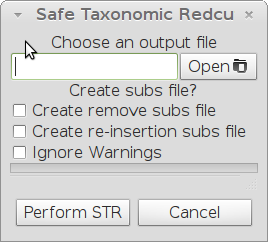

    STR interface. The output file contains the equivalency matrix. The two
    optional sub files will automatically allow deletion and reinsertion of taxa
    where this is safe to do so.

Create subset
*************

You may want to create a subset of your entire dataset, based on, say, year of
publication, characters used or taxa included. The create subset allows you to
define criteria on which this subset can be created. The GUI (Fig.
:num:`#img-stk-subset1`) allows you to create this search by clicking "Add".
Then select the criterion from the drop-down list on the left hand side. Then in
the right hand column, enter your terms. For years you can enter a range, like
2000-2010. For all terms, a comma separated list can be used to enter multiple
terms (Fig.  :num:`#img-stk-subset2`).

.. _img-stk-subset1:

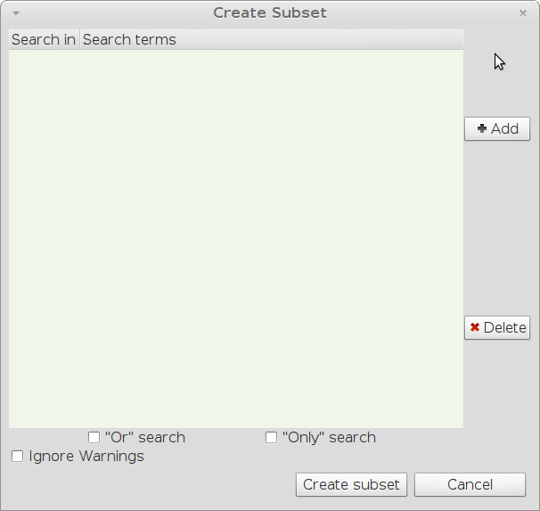

    The initial create subset interface. The two buttons on the right allow you
    to add and delete terms. Terms appear in the main part of the window. The
    left side of this contains a drop down list to select the criterion. The
    right hand side is where you enter terms.

.. _img-stk-subset2:

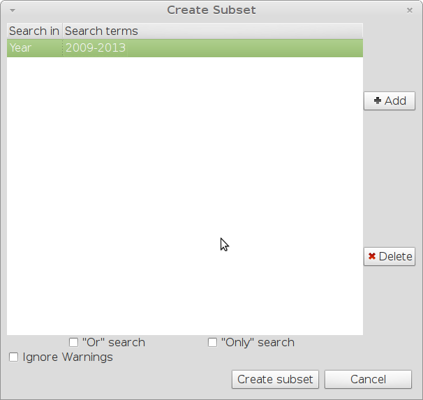

    A search for data published between 2009 and 2013 has been set up.

Once complete, a search will ask you to save the output to a new Phyml file.

.. warning:: This new file does still need to be saved with a new file name, if you use the same filename as the existing file you will over-write your previous hard work so be aware!

Create matrix
*************

After all your processing, the final step is to create a matrix of your data.
This function will create a matrix suitable for reading into PAUP**, TNT and most
other supertree software. Note that some software require a set of "input
trees". In this case, use the "Export trees" function under the the "File" menu.
Matrices can be output in Nexus or Hennig (TNT) format. Simply select "Create
matrix", choose your options, including a filename, and click create matrix.
This might take a few minutes for large datasets. You can also add a taxonomy tree and optionally
ignore outgroups that have been specified for each tree.

Weights will only be used in TNT format and are applied automatically. Remove any "weights" elements
from your data if you do not wish to use weights.

.. _img-stk-matrix:

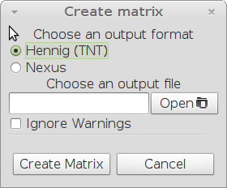

    The create matrix format. Select your options and click "Create matrix".

