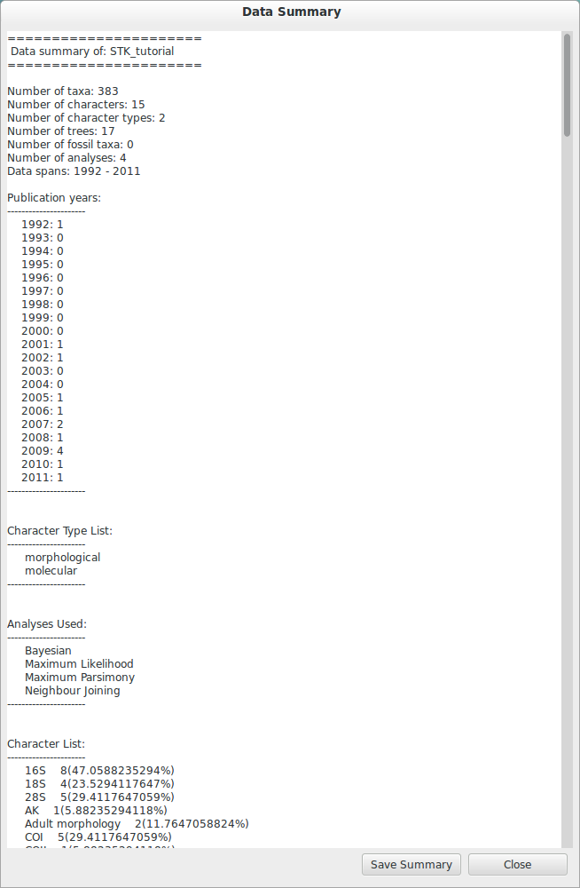
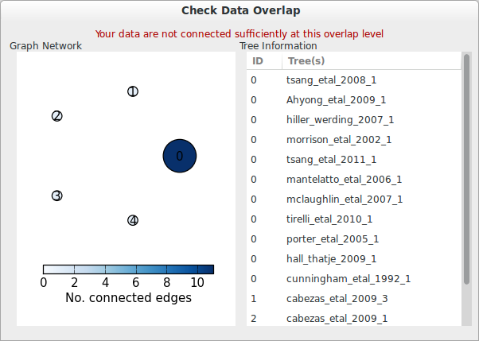
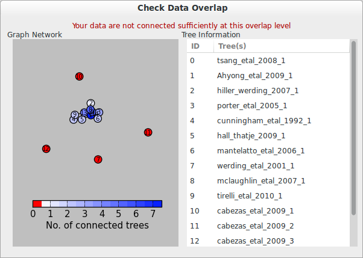
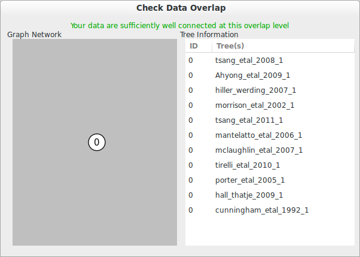
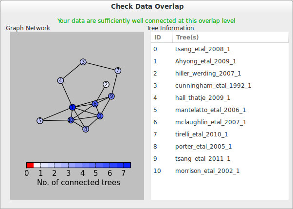

A STK Tutorial
==============

Introduction
------------

The following is an example of how the scripts were used in creating a
species-level supertree of `Anomura <http://en.wikipedia.org/wiki/Anomura>`_, - an infraorder of decapods.

There are several files included in the tutorial dataset:
    * A bibliographic bibtex file containing all the original bibliographic datasets
    * A semi-complete Phyml with a single tree missing
    * A tree file to import into the above
    * The completed original dataset
    * The complete processed dataset
    * The final matrix, ready for supertree construction
    * A supertree, generated using TNT

.. note:: This is a test dataset, which has been amended to show all the
    features and functions of the STK. Do not use in a real analysis.

The aim of this tutorial is to guide you through the stages of collecting,
storing and curating supertree source data. This can be divided into a number of
steps:
    * Collect and import bibliographic data
    * Collect, digitise and import trees
    * Standardise taxa (remove synonyms, higher-level taxa, etc)
    * Deal with polyphyletic taxa
    * Check data independence
    * Check taxonomic overlap
    * Create a subset
    * Create a matrix

In carrying out this tutorial, you will cover most of the functions of the STK.

Conventions
-----------

The bulk of the tutorial can be done using either the GUI or the command line.
Command line instructions are denoted by:

:command:`an example command`

GUI instructions are denoted by:

:menuselection:`Start --> Programs`

Filenames are given by the following:

:file:`an_important/file.phyml`

There are also notes along the way, which are shown like this:

.. note:: These are hints and tips

Finally, some warnings are also given:

.. warning:: This is a warning

Collecting Data
---------------

Data collection occurs in two stages: literature collection and tree
digitisation. 

Literature collection is carried out searching for relevant taxonomic terms in
conjunction with terms such as "phylog*" in order to obtained literature
containing original phylogenetic trees.  Bibliographic data is stored in
`Bibtex format <http://www.bibtex.org/>`_, as the STK can import Bibtex files
directly. Bibtex is a common format and all decent reference managers can
output, as can most journal websites. We recommend using `JabRef
<http://jabref.sourceforge.net/>`_, which is free, open source and available on
most operating systems. We have tested the STK extensively with output from
JabRef, but your mileage with other reference managers may vary. 

Once all bibliographic data are collected they can be imported into the STK to
provide the basic information for your dataset. 

Open a new instance of the GUI by double clicking the installed icon, or typing
stk_gui at a terminal. Using the menus, go to :menuselection:`File --> Import from
bibliography`. Use the GUI dialog to navigate to the Bibtex file
:file:`tutorial/bibliography.bib` and open it.  You will now see a list of
sources in the left hand side of the GUI. Note that all sources appear blue as
there is a lot of missing meta data that needs completing. 

.. _img-tut-bib-import:

.. figure:: images/import_bib_result.png   
    :align: center
    :scale: 75 %
    :alt: STK GUI after importing bibliographic data
    :figclass: align-center

    The result of importing the bibliographic file included in the tutorial.
    Note the blue colour, which means there is missing data (the trees and
    associated metadata).

The next step is to digitise your trees and import them. We've already done
this, so open :file:`tutorial/starting_data.phyml` which will have the
bibliographic data and all but one source tree completed. 

You can practice digitising trees using `Treeview <http://taxonomy.zoology.gla.ac.uk/rod/treeview.html>`_, 
`Mesquite <http://mesquiteproject.org/mesquite/mesquite.html>`_ or
similar software. The tree missing from the dataset is shown below.

.. _img-tut-missing-tree:

.. figure:: images/cabezas_etal_2009.pdf   
    :align: center
    :scale: 75 %
    :alt: Cebezas et al 2009 tree
    :figclass: align-center

    This is the tree missing from the dataset

To add the remaining source tree, navigate the source to reach Cabezas et al 2009
(this is easy as it's the only blue source highlighted). Drill down to reach the
tree_string entry (again, the only blue one). On the lower left of the GUI,
click :menuselection:`Import tree` and navigate to the tree file
:file:`tutorial/Cebezas_etal_tree1.tre` (or use your own digitised tree). 
This should place the tree file into the GUI.

.. _img-tut-import-missing-tree:

.. figure:: images/browse_missing_tree.pdf   
    :align: center
    :scale: 75 %
    :alt: Using the GUI to import a tree
    :figclass: align-center

    Using the blue colour as a guide, navigate to the source with missing tree.
    Click :menuselection:`Import tree` (circled in red) and load the tree.

Now save your Phyml using the :menuselection:`File --> Save As` and type in a name
(suggest :file:`Anomura.phyml`).

.. note:: Once done, this is your original file before any processing. Keep this
    safe. When you extend or alter the data later, you should begin with this
    file.

It is worth noting at this point that polyphyletic taxa  need some special attention. The STK allows
you to *permute* the positions of these taxa and generate a tree with all possible combination of
places of the taxa. These permuted trees can then be dealt with later. However, you must be aware of
this when digitising trees. To indicate a taxon is polyphyletic append a '%d' on the end of the name
where d is an integer. For example, Fig. :num:`#img-tut-poly-tree` can be encoded as: 

.. _img-tut-poly-tree:

.. figure:: images/poly_tree.pdf  
    :align: center
    :scale: 75 %
    :alt: A polyphyletic tree
    :figclass: align-center

    Polyphyletic clades can be denoted with %n in the name as above.

.. code-block:: bash

        (Artemia_salina, (((Pagurus_pollicaris, Pagurus_longicarpus%1), 
        ((Labidochirus_splendescens, (Elassochirus_tenuimanus, (Pagurus_bernhardus,
        Pagurus_acadianus, Pagurus_longicarpus%2))), (Lithodes_aequispinus, 
        Paralithodes_camtschaticus))), (Clibanarius_vittatus, Coenobita_sp.)));

You can see such a tree in the tutorial dataset in Cunningham et al 1992. We will
see how to permute these trees later in the tutorial

At this point it's worth creating a data summary -- this will allow to to spot
data input errors: typos, copy and paste errors, etc. Execute the data summary
command using the GUI or command line:

:menuselection:`STK Functions --> Data Summary`

:command:`stk data_summary -d summary.txt Anomura.phyml`

*Carefully* check the output for errors. However, it is important not to correct
"errors" that exist in the original paper -- these are dealt with later.
However, the data summary will allow you to spot where you might have mistyped a
character (CYtb instead of Cytb, for example) or didn't quite copy and paste the
taxa correctly (missing the last few characters for example). All lists are
sorted alphabetically, which makes spotting these kinds of errors relatively
straightforward.

.. _img-tut-data-summary:

    Example data summary.

There are other basic *housekeeping* tasks that can be useful at this point too.
First, standardising the source names using :menuselection:`STK
Functions --> Standardise source names` to ensure each source has a unique name.
Second, cleaning the data using :menuselection:`STK --> Clean data` to remove all
uninformative trees and remove polyphyletic taxa where only one possible
combination exists.

The above tasks will not alter the tutorial data, so it's safe to save the file
again. Normally you would use :menuselection:`File --> Save As` to be sure of not
overwriting data. Note that the file has altered though. If you navigate to the
*History* section you will see that the data summary and clean data commands
have been recorded, along with the date and time. This enables you to track what
commands have been run on this Phyml dataset.

Standardising Taxa
------------------

.. warning:: From this point on we will create a new file for each step of the process. This is good
    practice in case of user or software errors. Take note of the filename changes as we process the
    data.

The next stage is to standardise the taxa - removing synonyms and higher taxa.

.. note:: The tutorial dataset has a sub file already defined. Below is for information only.

Removing synonyms requires that a "standard" taxonomy is used. It does not matter what this is, but
it does matter that two taxa that are actually the same taxa have the same name  to avoid artificial
inflation of the taxa number and also to improve overlap between the source trees.  Services such as
`ITIS <http://www.itis.gov/>`_, `WORMS <http://www.marinespecies.org/>`_, `Encylopedia of Life
<http://eol.org/>`_ and other online, specialised, databases are useful. In future the functionality
of creating a standardised taxonomy is planned to be included in STK. Once a standardised taxa has
been decided, the names can be replaced. 

Use your taxonomy to create a *subs file*. This can be done manually in a
standard text editor or using the STK GUI. A subs file is a simple text file
where taxa equivalency is denoted. Using a text editor, create a file like this
one:

.. code-block:: bash

    Aegla denticulata denticulata = Aegla denticulata
    Axius vivesi = Neaxius vivesi
    Calcinus tibicen = Gilvossius setimanus
    Callianqssa tyrrhena = Callianassa tyrrhena
    Cambarus bartoni = Cambarus bartonii
    Cliopagurus galzini = Ciliopagurus galzini

Note that spaces can be replaced with underscores if needed, but there needs to be spaces *both*
sides of the '=' sign. The above is an excerpt from the subs file included in the tutorial dataset,
which replaces a sub-species and corrects some common mispellings and synonyms.

Alternatively, create a simple CSV (Comma Separated Value) file in Excel or
similar. The first column contains the taxa already in the dataset and the subsequent
columns are the taxa to be substituted in. Each substitution is on a new row. Ensure you save the
file as a Comma Seperated Value (CSV) file.

The above can be created using the GUI which ensures you only add taxa already
in the dataset on the left-hand side. Using :menuselection:`STK Functions --> Sub
taxa`, you will be presented with the interface below.

Move taxa from the left to the right using the arrows. Then double-click the
second column on the right-hand side and add the taxa to be subbed to this
column. Using the subs defined above, the GUI will look like this.

Note you should export the substituions at this point into a subs file to save
it for later.

Once you have a *subs file* you can replace the taxa. Using either the GUI or
the command line, run the sub taxa function on your Phyml. In the GUI, import
your subs file (or CSV file) and, fill in a new filename and click
:menuselection:`Sub taxa`. For the CLI, run this command:

:command:`stk sub_taxa -s subs_file input.phyml output.phyml`

This replaces and deletes the taxa defined in your *subs file* in all trees in
your dataset.

For our tutorial dataset, we have already created the subs file for you. Run
this on :file:`Anomura.phyml` using the GUI or command line:

:command:`stk sub_taxa -s standard_taxonomy.dat Anomura.phyml Anomura_subbed.phyml`

In the GUI use :menuselection:`STK Function --> Sub taxa` and then
:menuselection:`Import subs` to import the subs file. Then click
:menuselection:`Sub taxa`. This will give you a warning message. This is fine,
so click OK (we want to put in new taxa). Now save the currently open file
(:file:`Anomura.phyml`) as a new *history* entry has been added, containing
details of the substitution.

Removing polyphyletic taxa
----------------------------

To remove polyphyletic taxa and sub-species, the tree permutation function is
used. As mentioned above, polyphyletic taxa are dealt with separately and
denoted with a '%n' in the taxon name where n is an integer. We deal with these
taxa by permuting every possible location of these taxa. This creates a number
of trees per source tree, each with a different combination of the polyphyletic
taxa (which sub-species can be). Note that this produces unique trees only.
These can then be used to create a matrix or output in a single tree file. You
take this and create a 'mini-supertree' which becomes your single source tree.
For example load into PAUP or TNT and get the tree required with a
branch-and-bound search or heuristic search for larger trees.

There is one tree in our test dataset that requires removal of polyphyletic taxa.
Create a matrix using either :menuselection:`STK Functions --> Permute all trees`
(call the output :file:`anomura_poly.tnt` and use Hennig format) or use the command:

:command:`stk permute_trees -c hennig Anomura_subbed.phyml Anomura_poly.tnt`

The above command will create a matrix for each permutable tree (in this case
one matrix) which will be called
:file:`anomura_poly_cunningham_etal_1992_1.tnt`. 

Run this matrix in TNT to generate a mini-supertree. The commands below are
suggestions for how to do this in TNT. 

.. code-block:: bash

    run anomura_poly_cunningham_etal_1992_1.tnt;
    ienum;
    taxname=;
    tsave *permuted_cunningham_etal_1992.tnt;
    save;
    tsave /;
    nelsen*;
    tsave *permuted_cunningham_etal_1992_strict.tnt;
    save /;
    tsave /;
    quit;

You can then re-import this tree into your dataset, replacing the original tree
with the strict consensus :file:`permuted_cunningham_etal_1992_strict.tnt`.
Navigate to Cunningham_et_al_1992 and replace the tree with the % symbols in the
taxa name by clicking :menuselection:`Import tree`.

.. note:: This is the "standard" data - *keep this* as this is what gets updated
    when new trees are added to the dataset.

*The next few steps need doing each time you need to generate a supertree after
adding more source data and have re-standardised the taxa*

Remove unnecessary data
------------------------

This is the first step that is needed each time a tree is generated. We need to
check for data independence, remove vernacular and higher names.

The data independence check is done via the data independence function. The function
checks if any source meets the following conditions: 
    * Uses the same characters 
    * *and* is either a subset of, or contains the same taxa as, another source.

If these two conditions are met, the two sources are not independent. If the two
sources are identical (same taxa and same characters) it is up to you which one
is included, or you can create a mini-supertree of them to create a single
source. When one source uses the same characters but is a taxonomic subset of
another, you should include the larger source tree. The data independence
function places source trees into these two categories and informs you of the
equivalent source. You can then simply delete sources as required using the GUI.
The STK can automate most of this process (but do check the result to make sure
you agree). 

Using the command line, type the following:

:command:`stk data_ind  Anomura_poly.phyml -n  Anomura_ind.phyml`

This will create a new Phyml with all non-independent *subset* data removed, using
the above rules. Trees that are identical will not be removed. You have to
decide which one should be removed or combine them using a mini-supertree. The
same can be achieved in the GUI using the 
:menuselection:`STK Functions --> Data Independence Check` and 
clicking :menuselection:`Remove subsets and save`, giving
:file:`Anomura_ind.phyml` as the filename.

To deal with identical data, open a new STK GUI and give it a temporary name.
Then copy and paste the sources that contain the identical trees from your
existing dataset into your new one. You can delete any trees that aren't
identical but were copied over at this point. You can now make a matrix using
:menuselection:`Stk Functions --> Create Matrix` and create a supertree. 

For our tutorial dataset we have the following non-independent data:

.. code-block:: bash
    Source trees that are subsets of others
    Flagged tree, is a subset of:
    boyko_harvey_2009_1,mclaughlin_etal_2007_1

    Source trees that are identical to others
    Flagged tree, is identical to:
    Ahyong_etal_2009_2,Ahyong_etal_2009_1

So, running 

:command:`stk data_ind  Anomura_poly.phyml -n  Anomura_ind.phyml`

or via the GUI, you can remove Boyko and Harvey 2009, tree 1 manually or use the 
:menuselection:`STK Functions --> Data Independence Check` and 
clicking :menuselection:`Remove subsets and save`, giving
:file:`Anomura_ind.phyml` as the filename.

.. warning:: If you removed the source manually, remember to "Save as"

To deal with the two identical trees, open a new STK GUI and copy and 
paste the Ahyong_etal_2009 across. This source only contains those two 
trees, so simply create the matrix using :menuselection:`STK Functions --> Create Matrix`.
Run this matrix in TNT (see above for example commands) to create a 
combined source tree to import back into your original
(:file:`Anomura_ind.phyml`) file

In :file:`Anomura_ind.phyml`, remove one of the Ahyong_etal_2009 source trees
and import the output from TNT into the other. It is advisable here to edit the
figure legend etc to match that this is now a combined tree (in this dataset the
figure legend etc contain dummy data) and to add a comment on this tree with the
TNT commands used as a reminder in future of where this tree came from. Save
this Phyml as :file:`Anomura_ind_final.phyml`. There is no need to save your
temporary file.

Remove higher taxa
------------------

Our dataset currently contains vernacular names and higher-order (e.g. family)
names. These have to be removed and replaced with polytomies. 
As this must happen each time a supertree is produced, it
is best done with via a taxa substitution file. You can create this file once,
amend as appropriate and run each time you alter the data before supertree
analysis is done. For example:

.. code-block:: bash

    Aegialornithidae = Aegialornis
    Ciconiidae = Mycteria,Anastomus,Ciconia,Ephippiorhynchus,Jabiru,Leptoptilos

replaces any source tree containing the higher order taxa *Aegialornithidae* or
*Ciconiidae* with polytomies. You only need to to give genera, we will need deal with replacing
genera with species at a later stage. Note that the genera
listed should be in the dataset already, but you can avoid thoroughly checking this as
you can use the "replace existing taxa only" option in the replacement. You
can use the data summary output to check how well these substitutions have worked.
Genera only are needed as the next step will replace genera with species-level taxa.

Note we can replace using genus or species names. In the former, the genera
will be replaced with specific names in a later step. Therefore, it is
recommended you make your substitution file as comprehensive as possible. You
can then keep it for later, when you extend the dataset.

Once your substitution file is ready, you can use either the GUI or CLI to
replace taxa in a Phyml. The output of this is a new Phyml with the taxa replace
or deleted as dictated in your subs file.

The command line would be:

:command:`stk sub_taxa -e -s SUBFILE input.phyml output.phyml`

To use the GUI, simply clicking :menuselection:"`STK Functions -> Sub Taxa`,
loading your subs file, and clicking :menuselection:`Sub taxa`.

.. note::  It is important here to only substitute in *existing taxa* so use
           the -e flag on the CLI and click the :menuselection:`Only existing
           taxa` in the GUI

Finally, to guard against errors and bugs, back-up your data '''before'''
carrying each set of substitutions. If you come across something that went wrong, report
a bug on our Launchpad. Replacing taxa in trees is not straightforward at times
so this definitely the time to check your backups.

Our Anomura data have no such higher taxa, however, we have introduced an extra
taxon by creating the mini-supertrees earlier; MRP_Outgroup. Carry out a data
summary on :file:`Anomura_ind_final.phyml` and you should see this taxon in
the list. We can remove this easily, by doing a simple substitution. In the GUI,
use :menuselection:`STK Functions --> Sub taxa` to move MRP_Outgroup from the left
 to the right of the interface. Leave the second column blank, and click
:menuselection:`Substitute taxa` to delete this. Save the file as
:file:`Anomura_ind_final_2.pyml`.

On the command line use the following command:

:command:`stk sub_taxa -o MRP_Outgroup Anomura_ind_final.phyml Anomura_ind_final_2.phyml`

which will delete the taxon.

Replacing genera
++++++++++++++++

The final part of this process is to replace all genera with their constituant
species that are already present in the dataset, e.g. *Gallus* is replaced with a polytomy of all species belonging to
*Gallus*. This is done with the replace genera function. Only species already in
the dataset are added. This is a short-cut function of the general
substitute taxa functions, but it generates the substitutions.

To run this you can either use the GUI or CLI. The CLI command is:

:command:`stk replace_genera Anomura_ind_final_2.phyml Anomura_species.phyml`

In the GUI, use :menuselection:`STK Functions --> Replace genera`. Get the STK to
create a new Phyml for you, named :file:`Anomura_species.phyml`

Your data is now almost ready for making a supertree!

Check data
----------

This stage makes sure that the data is suitable for inclusion in the final
supertree analysis. The first step is to create a data summary. This creates a
list of useful information, such as taxa and characters. The information is
printed alphabetically, which makes it easy to check for final errors. Although
this is not necessary, it allows manual checking of the data, e.g. were genera replaced where
species are also in the dataset? are there any
odd names that I forgot to substitute?

Have a look in the file output and check everything is OK. If not, go back and
fix things. Note that some of the statistics in the file might be useful when
writing up your papers - how many trees, over what years the data are from, types of characters in
the dataset, etc.

The final step is to ensure that there is sufficient taxonomic overlap between source
trees.  We need to check that all the trees are connected by at least two
taxa with another tree. You may also want to experiment with using higher
numbers, use the data overlap function to determine this. The output can either
be a simple yes/no or graphical output. Graphical output can either be a
detailed view where a graph is produced whereby each source is a vertex and
edges are drawn between sources that share the required number of taxa (Fig
:num:`#img-tut-pre-detailed-overlap`) . In this view *all* nodes should be
blue, with no red (unconnected). However, for large datasets, this consumes a lot
of memory and can take a long time to calculate. Instead use the normal view
where connected trees compose a node in the graph (Fig
:num:`#img-tut-pre-overlap`). In this view there should be a single
node only.

.. _img-tut-pre-overlap:

    Graphical view of data overlap. For a correctly connected dataset
    there should be no unconnected nodes -- i.e. there should be a single node.
    These data are not sufficiently well connected.

.. _img-tut-pre-detailed-overlap:

    Detailed graphical view of data overlap. There should be no red nodes in 
    a dataset that is well connected.

To carry out this step on our data in the CLI run this command:

:command:`stk data_overlap Anomura_species.phyml`

It will return a message saying your data are not sufficiently well connected. We can find out which trees are not
connected using:

:command:`stk data_overlap -g overlap_2.png -d Anomura_species.phyml`

Using the GUI, use :menuselection:`STK Functions --> Check data overlap`. Click
:menuselection:`Check overlap` and it will return a message about insufficient
overlap. Run it again, with graphical output and you will see the following
output.

Remove the following trees from the dataset:
 * Cabezas et al 2009
 * Werding et al 2001

You should then have 12 trees remaining. Remove the above and regenerate the
overlap graphic -- this time it should return a message saying your data are sufficiently well
connected. Save your data to :file:`Anomura_final.phyml`.

.. _img-tut-post-overlap:

    Graphical view of data overlap. For a correctly connected dataset
    there should be no unconnected nodes -- i.e. there should be a single node.
    These data are now well connected.

.. _img-tut-post-detailed-overlap:

    Detailed graphical view of data overlap. There are now no red nodes.

create matrix
-------------

You now have a dataset ready for creating a supertree. The final step is
to create a matrix.

Open :file:`Anomura_final.phyml` and use 
:menuselection:`STK Functions --> Create matrix` and fill in the GUI to create
a matrix. Create a TNT matrix and save to :file:`Anomura_matrix.tnt`

Alternatively, use:

:command:`stk create_matrix Anomura_final.phyml Anomura_matrix.tnt`

