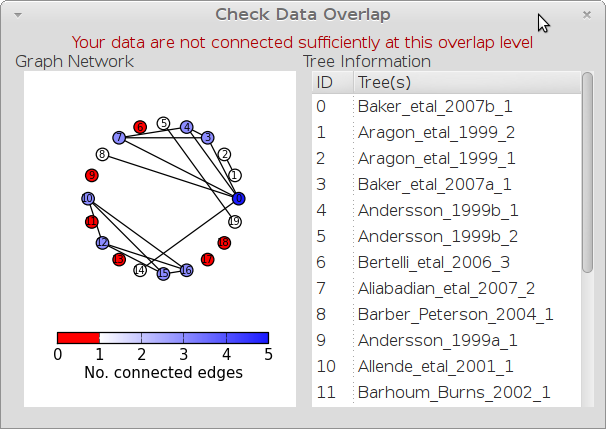
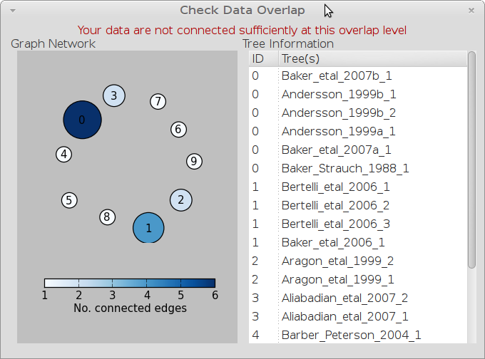

A STK Tutorial
==============

Introduction
------------

.. note:: old_tutorial

The following is an example of how the scripts were used in creating a species-level supertree of birds.

The whole procedure can be divided into 5 stages:
 # Collect data
 # Standardise taxa
 # Remove unnecessary data and taxa
 # Check data
 # Create matrix

Collecting Data
---------------

Data is collected from literature as Nexus tree files and bibliographic (bibtex)
files. The easiest way to start is to create a bibtex file of your source data.
You can then import this to create your sources.

For each source you then create each tree you want to include in the analysis.
For each tree, you should also record the page and figure number, the characters
used, the analysis used and any other relavant information .Data is transcribed
*exactly* as it is in the original source paper. We deal with incorrect taxa
later. 

.. note:: Once done, this is your original file before any processing. Keep this safe. When you extend the data later, you should begin with this file.
 

One of the time consuming tasks is to digitise trees from the papers. Authors
rarely give digital trees, so you must use programs such as TreeView or Mequite
to turn the graphic in the paper into a digital tree file. This is normally a
Nexus file, though the STK can parse the trees from most of the popular tree
creation software packages. Note that paraphyletic taxa are encoded differently.
For example consider a tree as in figure .

Rather than include subspecies (we assume you want a species level tree), which
would then involve adding subspecies everywhere, you can tell the STK that these
taxa should be considered as one. We then remove these in the next step. We
would therefore encode this tree as shown in figure .

At this point it's worth creating a data summary -- this will allow to to spot
data input errors: typos, copy and paste errors, etc. Execute the data summary
command and *carefully* check for errors. However, it is important not to
correct "errors" that exist in the original paper -- these are dealt with later.
However, the data summary will allow to spot where you might have mistyped a
character (CYtb instead of Cytb, for example) or didn't quite copy and paste the
taxa correctly (missing the last few characters for example). All lists are
sorted alphabetically, which makes spotting these kinds of errors relatively
straightforward.

.. todo:: Video of entering data (link to this) and screenshots of the process (from video?)

Standardising Taxa
------------------

The next stage is to standardise the taxa - removing synonyms, polyphyletic taxa
and sub-species.

To remove polyphyletic taxa and sub-species, the tree permutation function is
used. This creates a number of trees per source tree, each with a different
combination of the paraphyletic taxa (which sub-species can be). Note that this
produces unique trees only. These can then be used to create a matrix or
output in a single tree file. You take this and create a 'mini-supertree' which
becomes your single source tree. For example load into PAUP and get the tree
required with a branch-and-bound search or heuristic search for larger trees.

.. note:: This is the "standard" data - *keep this* as this is what gets updated when new trees are added to the dataset.

Removing synonyms requires that a "standard" taxonomy is used. It does not
matter what this is, but it does matter that two taxa that are actually the same
taxa have the same name. Services such as `ITIS <http://www.itis.gov/>`_ and
other online databases are useful. In future this functionality is planned to
be included in STK. Once a standardised taxa has been decided, the names can be
replaced. 

Use your taxonomy to create a *subs file*. This can be done manually in a
standard text editor or using the STK GUI.

Once you have a *subs file* you can replace the taxa. Using either the GUI or
the command line, run the sub taxa function on your Phyml. This replaces and
deletes the taxa defined in your *subs file* in all trees in your dataset.

*The next few steps need doing each time you need to generate a supertree after adding data*

Remove unnecessary data and taxa
--------------------------------

This is the first step that is needed each time a tree is generated. We need to
check for data dependence, remove vernacular and higher names and finally, make
all taxa specific.

Data independence check is done via the data indepenedence function. The
function checks if any source meets the following conditions:
 * Uses the same characters
 * *and* is either a subset of, or contains the same taxa as, another source.

If these two conditions are met, the two sources are not independent. If the two
sources are identical (same taxa and same characters) it is up to you which one
is included, or you can create a mini-supertree of them to create a single
source. When one source uses the same characters but is a taxonomic subset of
another, you should include the larger source tree. The data independence
function places source trees into these two categories and informs you of the
equivalent source. You can then simply delete sources as required using the GUI.

Our dataset currently contains vernacular names and higher-order (e.g. family)
names. This have to be removed by hand and replaced with polytomies of taxa that
are part of that name. As this must happen each time a supertree is produced, it
is best done with via a taxa substitution file. You can create this file once,
amend as appropriate and run each time you alter the data before supertree
analysis is done. For example:

.. code-block:: bash

    Aegialornithidae = Aegialornis gallicus,Aegialornis leenhardti 
    Ciconiidae = Mycteria,Anastomus,Ciconia,Ephippiorhynchus,Jabiru,Leptoptilos

replaces any source tree containing the higher order taxa *Aegialornithidae* or
*Ciconiidae* with polytomies of species within the group. Note that the species
listed do *not* need to be in the dataset already, though you will need to
ensure you use the "replace existing taxa only" option in the replacement. You
can use the data summary output to check this.

Note we can replace using generic or specific names. In the former, the genera
will be replaced with specific names in a later step. Therefore, it is
recommended you make your substitution file as comprehensive as possible. You
can then keep it for later, when you extend the dataset.

Once your substitution file is ready, you can use either the GUI or CLI to
replace taxa in a Phyml. The output of this is a new Phyml with the taxa replace
or deleted as dictated in your subs file.

For very large datasets it is probably best to split up your subs files into
stages. For example, replace Orders with Families; then another file for
Families to Groups; and a final file to go from Groups to genera.

Finally, to guard against errors and bugs, back-up your data '''before'''
carrying out substitutions. If you come across something that went wrong, report
a bug on our Launchpad.

The final part of this process is to replace all generic taxa with specific
taxa, e.g. *Gallus* is replace with a polytomy of all species belonging to
*Gallus*. This is done with the replace genera function. Only species already in
the dataset are substituted in.

Check data
----------

This stage makes sure that the data is suitable for inclusion in the final 
supertree analysis. The first step is to create a data summary. This creates a
list of useful information, such as taxa and characters. The information is
printed alphabetically, which makes it easy to check for final errors.

First step is to run stk_check_data (you have been running it all the time,
right?). Then produce a data summary. Although this is not necessary, it allows
manual checking of the data: were all the generic names removed where specific
taxa are also in the data? are there any odd names that I forgot to substitute?

Have a look in the file output and check everything is OK. If not, go back and
fix things. Note that some of the statistics in the file might be useful when
writing up your papers - how many trees, over what years the data is from, etc,
etc.

Next, we need to check that all the trees are connected by at least two taxa
with another tree. You may also want to experiment with using higher numbers.
Use the data overlap function to determine this. The output can ither be a
simple yes/no or graphical output. Graphical output can either be a detailed
view where a graph is produced whereby each source is a vertex and edges are
drawn between sources that share the required number of taxa (Fig
:num:`#img-stk-data-overlap-detailed2`) . In this view *all* nodes should be
blue, with no red (unconnected). However, for large datasets, this consume a lot
of memory and can take a long time to calcualte. Instead use the normal view
where connected trees compose a node in the graph (Fig
:num:`#img-stk-data-overlap-simple2`). In this view there should be a single
node only.

.. _img-stk-data-overlap-detailed2:

    Detailed graphical view of data overlap. For a correctly connected dataset
    there should be no red nodes (circles) in the graph. These data is not sufficiently well
    connected.

.. _img-stk-data-overlap-simple2:

    Normal graphical view of data overlap. For a correctly connected datset
    there should be a single node (circle). These data is not sufficiently well
    connected.

Create matrix
-------------

Well done -- you have a dataset ready for supertree analysis. The final step is
to create a matrix. This is very simple and the create matrix funciton is used.
Simple tell the STK where to save and the format (Nexus fot PAUP, Hennig for
TNT) and your matric will be create.

